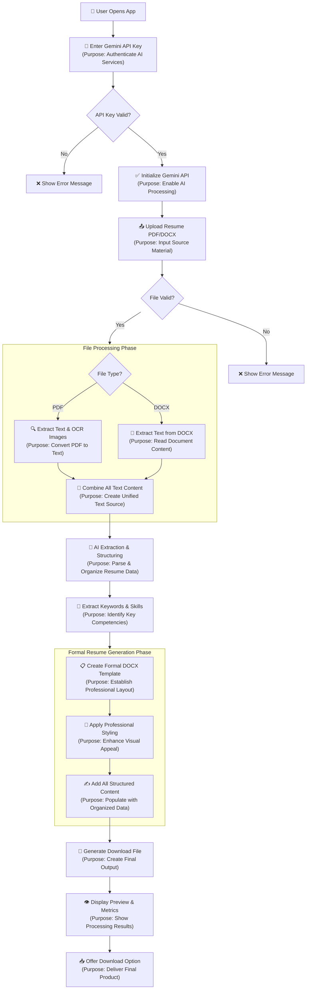

# Mermaid Diagram: Formal Resume Standardizer Process Flow

```mermaid
flowchart TD
    A[📄 User Opens App] --> B["🔑 Enter Gemini API Key<br>(Purpose: Authenticate AI Services)"]
    B --> C{API Key Valid?}
    C -->|No| D[❌ Show Error Message]
    C -->|Yes| E["✅ Initialize Gemini API<br>(Purpose: Enable AI Processing)"]
    
    E --> F["📤 Upload Resume PDF/DOCX<br>(Purpose: Input Source Material)"]
    F --> G{File Valid?}
    G -->|No| H[❌ Show Error Message]
    G -->|Yes| I[Process File]
    
    subgraph I [File Processing Phase]
        J{File Type?}
        J -->|PDF| K["🔍 Extract Text & OCR Images<br>(Purpose: Convert PDF to Text)"]
        J -->|DOCX| L["📝 Extract Text from DOCX<br>(Purpose: Read Document Content)"]
        
        K --> M["🧩 Combine All Text Content<br>(Purpose: Create Unified Text Source)"]
        L --> M
    end
    
    M --> N["🤖 AI Extraction & Structuring<br>(Purpose: Parse & Organize Resume Data)"]
    N --> O["🔑 Extract Keywords & Skills<br>(Purpose: Identify Key Competencies)"]
    
    subgraph P [Formal Resume Generation Phase]
        Q["📋 Create Formal DOCX Template<br>(Purpose: Establish Professional Layout)"]
        R["🎨 Apply Professional Styling<br>(Purpose: Enhance Visual Appeal)"]
        S["✍️ Add All Structured Content<br>(Purpose: Populate with Organized Data)"]
        Q --> R --> S
    end
    
    O --> P
    S --> T["💾 Generate Download File<br>(Purpose: Create Final Output)"]
    T --> U["👁️ Display Preview & Metrics<br>(Purpose: Show Processing Results)"]
    U --> V["📥 Offer Download Option<br>(Purpose: Deliver Final Product)"]
```
