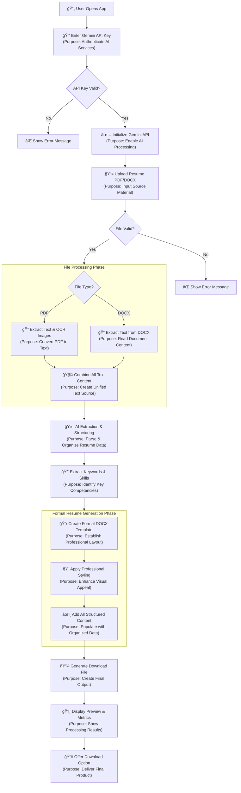

# Mermaid Diagram: Formal Resume Standardizer Process Flow



# 📄 Formal Resume Standardizer

A powerful Streamlit application that converts resumes into formal, professional formats using AI-powered processing. This tool extracts text from PDF and DOCX files, structures the information with Google's Gemini AI, and generates a standardized professional resume document.

## ✨ Features

- **Multi-format Support**: Process both PDF and DOCX resume files
- **AI-Powered Extraction**: Uses Google Gemini AI to intelligently extract and structure resume content
- **OCR Capabilities**: Extracts text from image-based PDFs using advanced OCR
- **Professional Formatting**: Creates beautifully formatted Word documents with consistent styling
- **Skill Extraction**: Automatically identifies and ranks key skills and competencies
- **Formal Language**: Rephrases content using professional business terminology

## 🚀 How to Use

1. **Enter API Key**: Provide your Google Gemini API key in the sidebar
2. **Upload Resume**: Select a PDF or DOCX file containing your resume
3. **Configure Settings**: Choose how many skills to include in your formal resume
4. **Process**: Click "Convert to Formal Resume" to begin processing
5. **Download**: Get your professionally formatted resume document

## 🛠️ Installation

### Prerequisites

- Python 3.8+
- Google Gemini API key

### Setup

1. Clone the repository:
```bash
git clone <repository-url>
cd formal-resume-standardizer
```

2. Install required dependencies:
```bash
pip install -r requirements.txt
```

3. Run the application:
```bash
streamlit run app.py
```

## 📋 Requirements

The application requires the following Python packages:

```
streamlit
PyMuPDF
Pillow
google-generativeai
python-docx
```

## 🔧 Configuration

### API Key Setup

1. Obtain a Google Gemini API key from [Google AI Studio](https://makersuite.google.com/)
2. Enter the API key in the sidebar when running the application
3. The key is only used during your session and not stored permanently

### Processing Options

- **Maximum Skills**: Control how many skills appear in your final resume (15-40)
- **OCR Processing**: Automatic image text extraction for PDFs with limited text
- **Formal Rephrasing**: All content is automatically converted to professional business language

## 📊 Output Features

The generated formal resume includes:

- **Professional Header**: Name and contact information in a clean layout
- **Styled Sections**: Consistent formatting for all resume sections
- **Horizontal Dividers**: Visual separation between content areas
- **Color Coding**: Professional color scheme with navy blue and dark gray accents
- **Bulleted Lists**: Proper formatting for experience descriptions and achievements
- **Skill Highlighting**: Prominent display of technical and professional skills

## 🔍 Processing Pipeline

1. **Text Extraction**: Raw text is extracted from uploaded documents
2. **AI Structuring**: Gemini AI parses and organizes resume content into structured data
3. **Skill Mining**: Keywords and competencies are identified and ranked
4. **Document Generation**: A professional Word document is created with formatted content
5. **Preview & Download**: Users can review extracted data and download the final resume

## 💡 Use Cases

- **Job Applications**: Create consistent, professional resumes for corporate roles
- **Career Advancement**: Refresh existing resumes with formal business language
- **Format Standardization**: Convert various resume formats to a uniform style
- **Skill Identification**: Automatically discover and highlight key competencies
- **ATS Optimization**: Generate resumes that perform well with applicant tracking systems

## ⚠️ Limitations

- Processing time depends on resume length and complexity
- Very image-heavy PDFs may have limited text extraction
- Complex formatting in original documents may not be perfectly preserved
- Requires an active internet connection for Gemini AI processing

## 📝 License

This project is provided for educational and professional use. Please ensure you comply with Google's Gemini API terms of service when using this application.

## 🤝 Contributing

Contributions to improve the resume standardizer are welcome! Please feel free to submit issues, feature requests, or pull requests.

## 📞 Support

For questions or issues related to this application, please check the documentation or create an issue in the project repository.

---

